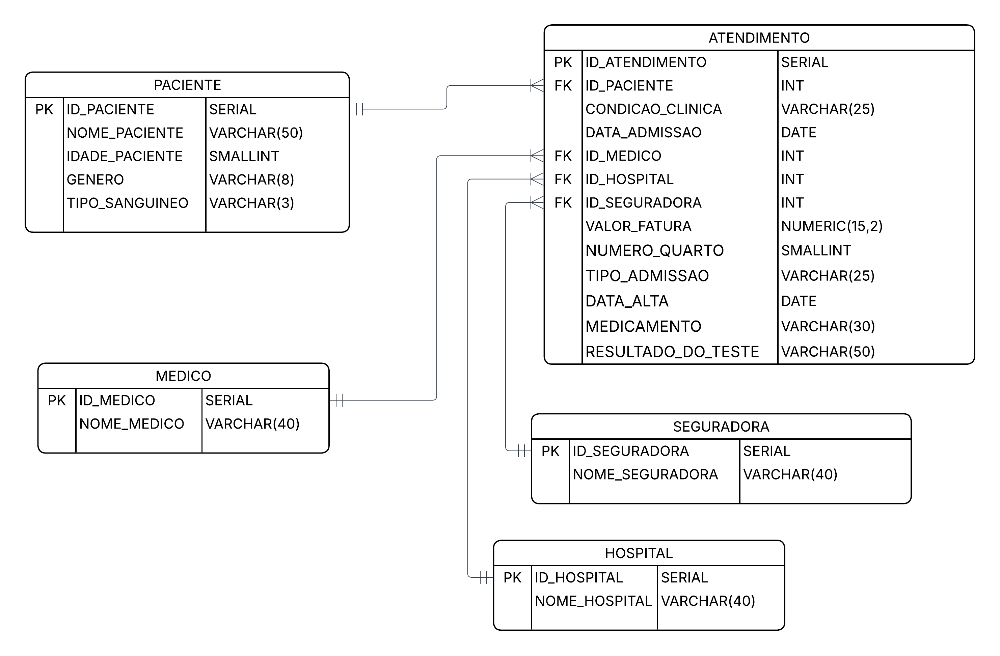

# ETL e Modelagem Dimensional — Setor de Saúde

## Sobre o Projeto

Este projeto aplica conceitos de **ETL/ELT** e **modelagem dimensional** sobre um dataset sintético da área da saúde. O objetivo principal é demonstrar, na prática, o processo completo desde a extração e tratamento dos dados brutos até a carga em um modelo dimensional estruturado no PostgreSQL — pronto para análise.

O projeto surgiu a partir da identificação de diversas inconsistências em uma tabela flat, o que motivou um estudo aprofundado sobre normalização, formas normais e boas práticas de modelagem de dados.

---

## Fonte dos Dados

Os dados utilizados são sintéticos e foram obtidos no Kaggle:

> 📂 [Healthcare Dataset — Prasad22](https://www.kaggle.com/datasets/prasad22/healthcare-dataset)

O dataset simula registros hospitalares com informações de pacientes, médicos, hospitais, seguradoras e atendimentos. Por ser gerado artificialmente, apresenta limitações de qualidade que foram identificadas e documentadas ao longo do projeto.

---

## Tecnologias Utilizadas

| Tecnologia | Finalidade |
|---|---|
| **Lucidchart** | Modelagem e diagrama relacional (ERD) |
| **Pentaho Data Integration** | Extração, transformação e carga na staging (ETL) |
| **PostgreSQL** | Armazenamento, modelagem dimensional e carga final (ELT) |

---

## Estrutura do Repositório

```
etl-modelagem-dimensional-saude/
│
├── Pentaho/
│   ├── Dados/
│   │   └── .gitkeep              # Arquivo CSV não versionado (ver .gitignore)
│   └── Transformacao/
│       └── transformacao.ktr     # Pipeline de transformação do Pentaho
│
├── PostgreSQL/
│   └── modelo_dimensional_saude.sql  # Script completo: staging, dimensões e fato
│
└── Documentacao/
    ├── Diagrama_relacional_ERD.png   # Diagrama ERD do modelo dimensional
    └── dicionario_de_dados.md        # Dicionário de dados do modelo dimensional
```

---

## Fluxo do Projeto

O projeto foi desenvolvido seguindo esta ordem:

### 1. Análise da Fonte
Identificação das inconsistências na tabela flat original: ausência de identificador único de paciente, redundâncias, campos sem padronização e problemas de qualidade dos dados.

### 2. Modelagem Conceitual — Lucidchart
Definição das entidades, atributos e relacionamentos. Criação do diagrama ERD antes de qualquer implementação.



### 3. ETL — Pentaho
Extração do CSV, tratamento e normalização dos dados (padronização de nomes, tipos de dados, remoção de inconsistências) e carga na tabela staging `stg_atendimentos` no PostgreSQL.

### 4. ELT — PostgreSQL
Criação das tabelas dimensionais e fato a partir da staging, com JOINs compostos para relacionar os dados e popular o modelo dimensional final.

---

## Arquitetura da Solução

```
Fonte (CSV)  →  Staging (stg_atendimentos)  →  Modelo Dimensional (PostgreSQL)
                      ↑                               ↑
                  Pentaho ETL                    ELT via SQL
```

### Modelo Dimensional

O modelo segue o padrão **Star Schema**, composto por:

- **fato_atendimento** — tabela central com os eventos de atendimento
- **dim_paciente** — dimensão de pacientes
- **dim_medico** — dimensão de médicos
- **dim_hospital** — dimensão de hospitais
- **dim_seguradora** — dimensão de seguradoras

---

## Principais Desafios e Decisões Técnicas

### 1. Ausência de identificador único de paciente
O dataset não possui nenhum campo que identifique unicamente um paciente (CPF, prontuário, ID etc.). Foram encontrados registros com o mesmo nome mas com idades diferentes na mesma data de admissão — tornando impossível determinar com certeza se tratava-se da mesma pessoa ou não.

**Decisão tomada:** cada combinação de `nome + idade + gênero + tipo sanguíneo` foi tratada como um paciente distinto. Essa é uma decisão de negócio documentada, não uma limitação técnica.

### 2. Chaves surrogadas em todas as dimensões
Por não existirem chaves naturais confiáveis no dataset, todas as dimensões utilizam chaves surrogadas (`SERIAL PRIMARY KEY`), geradas automaticamente pelo PostgreSQL.

### 3. Alta cardinalidade nas dimensões de médico e hospital
Foram identificados aproximadamente **40.341 médicos** e **39.876 hospitais** distintos em uma base de 55.500 registros. Esse volume não representa um cenário realista, sendo uma característica da geração sintética dos dados.

### 4. Relacionamento entre staging e dimensões via JOIN composto
A carga da tabela fato exigiu JOINs com múltiplas condições para localizar os IDs gerados nas dimensões, uma vez que a staging não possui os IDs — apenas os valores descritivos originais.

### 5. Dados sem estratégia de negócio
O projeto evidenciou na prática os problemas causados pela ausência de uma estratégia de dados desde a origem: falta de identificadores, redundâncias e inconsistências que não podem ser resolvidas apenas com técnica — exigindo decisões de negócio documentadas.


## Documentação

- 📊 [Diagrama ERD](Documentacao/Diagrama_relacional_ERD.png)
- 📖 [Dicionário de Dados](Documentacao/dicionario_de_dados.md)

---

## Aprendizados

- Aplicação prática de normalização e formas normais
- Diferença entre chave natural e chave surrogada
- Identificação e documentação de anomalias de dados
- Construção de um Star Schema a partir de uma tabela flat
- Importância da governança de dados desde a origem
- Uso de `INSERT INTO ... SELECT DISTINCT` e JOINs compostos para carga dimensional

---

## Autor

**Rister Silva**
[GitHub](https://github.com/RisterSilva) • [LinkedIn](https://linkedin.com/in/)
